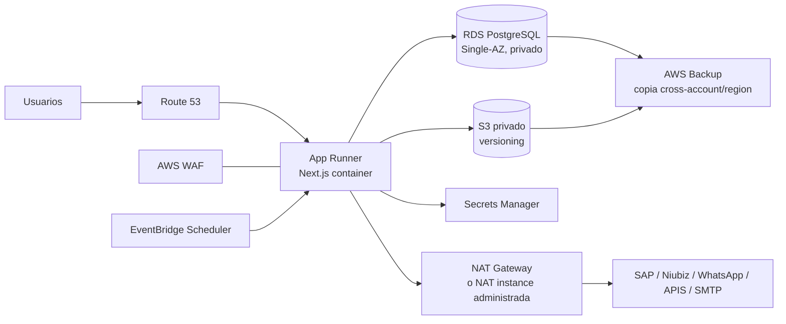
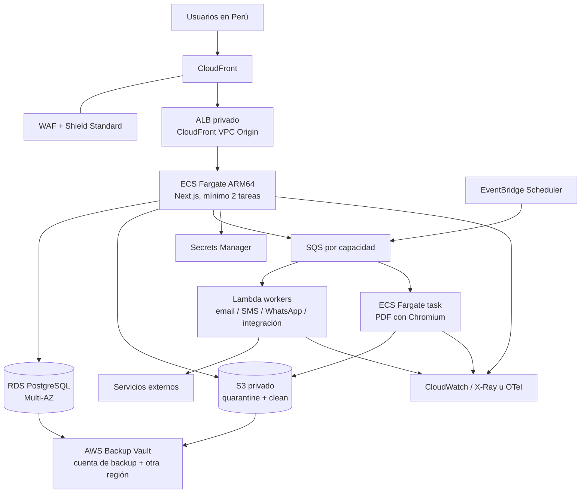
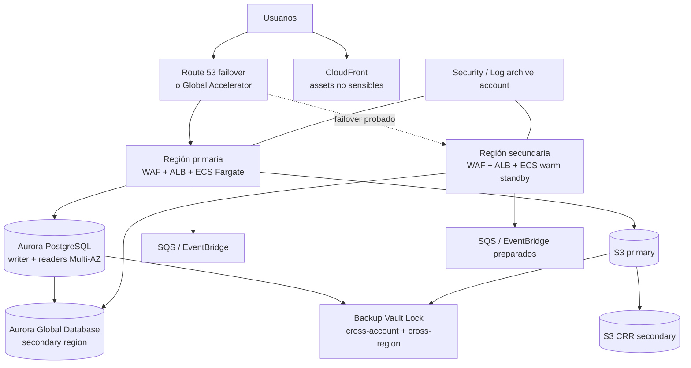

# Arquitecturas AWS propuestas

> Estado: propuesta técnica, no infraestructura implementada.<br>
> Fecha de análisis: 17 de septiembre de 2026.<br>
> Alcance: despliegue de la plataforma de Afiliaciones IIMP observada en este repositorio.

## Decisión ejecutiva

Se proponen tres niveles. La **Propuesta 2 — Producción equilibrada** es la recomendada: conserva el monolito modular Next.js en contenedores, usa PostgreSQL administrado Multi-AZ y extrae únicamente trabajos asíncronos bien delimitados. Ofrece la mejor relación entre costo, seguridad, rendimiento, estabilidad y esfuerzo de operación.

| Propuesta | Perfil | Disponibilidad | Costo mensual orientativo* | Recomendación |
| --- | --- | --- | ---: | --- |
| 1. Ahorro controlado | MVP o producción de tráfico bajo | Aplicación administrada; base Single-AZ | USD 90–180 | Válida si se acepta recuperación manual ante falla de AZ |
| 2. Producción equilibrada | Producción institucional | Aplicación y base Multi-AZ | USD 250–500 | **Recomendada** |
| 3. Alta resiliencia | Operación crítica y continuidad regional | Warm standby en dos regiones | USD 1,200–3,000+ | Solo con RTO/RPO contractual y equipo operativo maduro |

\* Rangos de planificación para tráfico bajo/moderado en `us-east-1`, pago por uso, sin impuestos, soporte Enterprise, Shield Advanced, mensajes SMS, correo, WhatsApp, Niubiz, SAP ni transferencia extraordinaria. No son una cotización. Deben reemplazarse por una estimación en AWS Pricing Calculator con métricas reales antes de aprobar presupuesto.

No se recomienda una migración completa de Next.js a funciones Lambda. La aplicación mantiene sesiones, usa Prisma/PostgreSQL, contiene 74 Route Handlers y genera PDF con Chromium/Puppeteer. Fragmentarla ahora aumentaría conexiones, latencia, complejidad de despliegue y superficie de fallos sin una ganancia demostrada. Lambda sí encaja en consumidores cortos, idempotentes y asíncronos.

## Evidencia analizada

La propuesta parte del `README.md`, `BIBLE.md`, `RULES.md`, los documentos de `docs/`, `prisma/schema.prisma`, las rutas HTTP, servicios compartidos y cada dominio bajo `modules/`.

### Carga observada por módulo

| Módulo | Responsabilidad observada | Implicación de infraestructura |
| --- | --- | --- |
| `afiliaciones/postulacion` | Formularios, estados, avales, adjuntos y envío | Escrituras transaccionales en PostgreSQL; archivos privados en S3; notificaciones asíncronas |
| `afiliaciones/expedientes` | Evaluación y administración de expedientes | RBAC estricto, auditoría, consultas relacionales y documentos privados |
| `afiliaciones/consulta` | Consulta pública, OTP y experiencia de pago | WAF, rate limiting, caché solo para contenido no sensible y protección antiabuso |
| `afiliaciones/payments` | Elegibilidad, autorización, sesión, callback y restauración de pago | Endpoint público autenticado por proveedor, idempotencia, trazabilidad y secreto dedicado por propósito |
| `afiliaciones/associates-integration` | Sincronización durable con sistemas externos | Patrón outbox/cola, reintentos con backoff, DLQ e idempotencia |
| `afiliaciones/alerts` | Alertas y sincronización programada | EventBridge Scheduler y consumidor asíncrono |
| `afiliaciones/asociados` | Aprovisionamiento y acceso del asociado | Transacción local y publicación durable del cambio hacia integraciones |
| `afiliaciones/portal` | Experiencia autenticada del asociado | Misma aplicación web y controles por recurso; no necesita un runtime independiente |
| `afiliaciones/observations` | Tipos y contratos de observaciones | Sin infraestructura propia; persiste con el agregado que la consume |
| `auth` | Auth.js, sesiones persistidas, login y recuperación | Sesiones siguen en PostgreSQL; rate limiting durable y secretos rotables; no se fuerza Cognito |
| `security` | Usuarios, roles, permisos y auditoría administrativa | Autorización server-side, logging inmutable y acceso privilegiado trazable |
| `master-data` | Catálogos y configuración | Lectura frecuente; caché selectiva solo después de medir consistencia |
| `dashboard` | Indicadores y actividad por área | Consultas medidas; réplicas/caché solo si las métricas justifican separar lecturas |
| `navigation` | Árbol de navegación autorizado | Servido por Next.js; su autorización no sustituye controles en API |
| `layout` | Shell y componentes de navegación | Assets en borde y renderizado dentro del mismo servicio web |
| `shared` | S3, SNS/SMS, SMTP, WhatsApp, SAP y APIS.net.pe | IAM por rol, secretos centralizados, salida a Internet controlada y observabilidad sin PII |

### Características que condicionan el diseño

- Next.js 16.2 y React 19 con ejecución de servidor, no un sitio estático.
- Prisma 6 y un modelo relacional PostgreSQL amplio: no se justifica reescribirlo en DynamoDB.
- Procesamiento de datos personales, documentos, autenticación, expedientes y pagos.
- Integraciones salientes a SAP, Niubiz, WhatsApp, APIS.net.pe y SMTP, además de S3/SNS.
- Generación de PDF con Puppeteer. Chromium requiere aislamiento, memoria y tiempo de CPU predecibles.
- Estado técnico verde en compilación, TypeScript estricto y pruebas, pero con deuda de lint y hallazgos de seguridad abiertos. Un build verde no equivale a preparación productiva.

## Condiciones previas para producción

La infraestructura no corrige vulnerabilidades de aplicación. Antes de exponer el sistema a usuarios reales se deben cerrar, como mínimo, estas brechas ya documentadas o visibles en el código:

1. Eliminar y rotar el token fallback de APIS.net.pe; ningún secreto puede residir en el repositorio.
2. Sustituir `AWS_ACCESS_KEY_ID` y `AWS_SECRET_ACCESS_KEY` de la aplicación por roles IAM de tarea o instancia.
3. Proteger login, OTP, recuperación, consulta pública, uploads y proxies de costo con límites distribuidos, no memoria local del contenedor.
4. Validar tamaño, MIME real, extensión, ownership y destino de archivos. Preferir upload directo con URL prefirmada a un prefijo de cuarentena.
5. Aislar la generación PDF, bloquear SSRF con allow-list de destinos y ejecutar Chromium con sandbox efectivo; no aceptar `--no-sandbox` como configuración productiva.
6. Separar tokens por propósito y endurecer callbacks de pago con autenticidad, idempotencia, monto, moneda y protección contra replay. Niubiz no debe pasar a producción solo por superar el build.
7. Añadir cabeceras HTTP de seguridad, política CSP probada y un endpoint de salud que no consulte dependencias externas innecesarias.
8. Definir retención de PII, clasificación de logs y evidencia de restauración de backups.

Hasta cerrar estos puntos, el estado correcto es **apto para preparar infraestructura de prueba**, no “production ready”. Véanse [Seguridad](SECURITY.md), [Pagos](PAYMENTS.md) y la [auditoría existente](../auditoria_seguridad.md).

## Principios comunes a las tres propuestas

### Seguridad

- Cuentas AWS separadas al menos para `production` y `non-production`, administradas con AWS Organizations; una cuenta adicional de `security/log-archive` en las propuestas 2 y 3.
- IAM Identity Center para personas, MFA y permisos temporales. CI/CD usa OIDC y roles de corta duración; nunca access keys permanentes.
- Aplicación, workers y migraciones con roles IAM distintos y mínimo privilegio.
- Base de datos y cargas de trabajo en subredes privadas. Solo el borde o endpoint administrado recibe tráfico público.
- AWS WAF con reglas administradas, límites por IP/identidad cuando corresponda y modo `COUNT` antes de bloquear. Shield Standard viene integrado; Shield Advanced es opcional y no forma parte del costo base.
- Secrets Manager para credenciales rotables; SSM Parameter Store para configuración no secreta. Cifrado KMS para RDS, S3, colas, logs y backups según clasificación.
- CloudTrail organizacional, AWS Config, GuardDuty, Security Hub y centralización de hallazgos desde la propuesta 2.
- Logs estructurados con `requestId`/`correlationId`, sin tokens, documentos ni PII. Alarmas de disponibilidad, latencia, errores, saturación, colas y fallos de integración.

### Datos, alta disponibilidad y backup

Alta disponibilidad y backup resuelven problemas distintos:

- Multi-AZ mantiene el servicio ante fallos de instancia o zona; no protege contra borrado lógico, corrupción de aplicación o credenciales comprometidas.
- Backups/PITR recuperan datos históricos; no garantizan conmutación instantánea.
- La restauración se considera real solo cuando un ejercicio automatizado demuestra integridad, tiempo y procedimiento.

Política base propuesta:

| Activo | Protección mínima | Validación |
| --- | --- | --- |
| PostgreSQL | Backups automáticos y PITR; retención productiva de 14–35 días | Restauración mensual en cuenta/entorno aislado y prueba funcional |
| Snapshots de largo plazo | AWS Backup: diarios 35 días, mensuales 12 meses, copia a otra cuenta; ajustar por política legal | Reporte mensual y alarma por job fallido |
| Documentos S3 | Versioning, cifrado, Block Public Access y lifecycle | Muestreo de restauración trimestral |
| Objetos críticos | Object Lock solo donde la política de retención esté aprobada | Prueba de lectura y expiración controlada |
| Configuración/secretos | IaC reproducible y secretos administrados; no copiar secretos a Git | Simulacro semestral de reconstrucción |
| Estado Terraform | S3 versionado, cifrado y bloqueo nativo | Recuperación de versión probada antes de producción |

AWS RDS permite restaurar a un segundo concreto dentro del período de retención mediante [recuperación a un punto en el tiempo](https://docs.aws.amazon.com/AmazonRDS/latest/UserGuide/USER_WorkingWithAutomatedBackups.html). Para inmutabilidad fuerte, AWS Backup Vault Lock en modo compliance impide cambios incluso por la cuenta raíz después del período de gracia; debe habilitarse solo tras probar retención y costos, porque su efecto es deliberadamente irreversible ([documentación](https://docs.aws.amazon.com/aws-backup/latest/devguide/vault-lock.html)).

### Rendimiento y estabilidad

- CloudFront entrega assets y respuestas expresamente cacheables cerca de Perú; nunca cachear páginas autenticadas, tokens, OTP, callbacks ni respuestas con PII.
- Imágenes, adjuntos y PDFs se sirven desde S3 mediante URLs firmadas cortas o CloudFront con Origin Access Control, no pasando el archivo completo por Next.js.
- Prisma conserva un pool acotado por réplica. Se fija un presupuesto: `réplicas máximas × conexiones por réplica + workers < max_connections` con margen operativo.
- Despliegues rolling o blue/green, health checks, rollback por imagen inmutable y migraciones expand/contract compatibles hacia atrás.
- SQS absorbe picos y evita que correo, SMS, WhatsApp, SAP o PDFs alarguen transacciones HTTP. Cada consumidor debe ser idempotente y tener DLQ.
- Se definen SLO antes de optimizar: disponibilidad, p95/p99, tasa de error, antigüedad de cola y objetivos de recuperación.

## Región primaria

AWS dispone de edge locations de CloudFront en Lima, mientras que la región sudamericana pública relevante es `sa-east-1` (São Paulo). La región primaria no debe elegirse por intuición:

1. Ejecutar pruebas desde Lima contra `us-east-1` y `sa-east-1` con login, carga de formularios, upload y consultas Prisma.
2. Comparar p95/p99, costo de RDS/Fargate/NAT, transferencia, requisitos contractuales y residencia de datos.
3. Confirmar que todos los servicios y capacidades usados por Terraform estén disponibles en la región elegida.

Para los rangos de este documento se asume `us-east-1` por costo. Si la latencia de operaciones dinámicas o una obligación de residencia lo exige, recalcular en `sa-east-1`. CloudFront mantiene el beneficio de borde para contenido cacheable desde ubicaciones como Lima ([red global](https://aws.amazon.com/cloudfront/features/)).

---

## Propuesta 1 — Ahorro controlado

### Objetivo

Salir a producción con la menor carga operativa y costo razonable, aceptando que la base Single-AZ puede requerir restauración o recreación y producir una interrupción prolongada.



### Componentes

- Imagen Next.js `standalone` en ECR y un servicio AWS App Runner de 1 vCPU/2 GB como punto inicial; autoscaling con máximo conservador para proteger PostgreSQL.
- AWS WAF asociado directamente a App Runner. AWS documenta esta integración para filtrar exploits y bots ([App Runner + WAF](https://docs.aws.amazon.com/apprunner/latest/dg/waf.html)).
- RDS PostgreSQL Single-AZ, clase Graviton burstable y almacenamiento gp3 cifrado, sin acceso público.
- VPC Connector de App Runner hacia subredes privadas. Al usarlo, el tráfico saliente deja de tener Internet público por defecto, por lo que las integraciones externas requieren NAT y los servicios AWS deberían usar VPC endpoints donde el costo lo justifique ([conectividad VPC](https://docs.aws.amazon.com/apprunner/latest/dg/network-vpc.html)).
- S3 privado con versioning, lifecycle y URLs prefirmadas. Secrets Manager, CloudWatch y AWS Backup.
- Scheduler llama un endpoint interno firmado o, preferiblemente, una tarea de mantenimiento dedicada; no reutilizar una ruta administrativa pública.

### Recuperación propuesta

- **RPO objetivo:** hasta 15 minutos para base de datos, sujeto a la ventana real de PITR.
- **RTO orientativo:** 2–8 horas ante pérdida de base/AZ; minutos ante reinicio simple de aplicación.
- Snapshot/copia diaria a otra cuenta y región; documentos versionados y replicación solo para clases críticas si el presupuesto lo permite.

### Ventajas y límites

- Menos recursos y operación sencilla; App Runner cobra memoria aprovisionada y CPU activa. El ejemplo oficial de 1 vCPU/2 GB y uso intermitente ilustra un costo bajo de cómputo, pero la base, NAT, WAF, logs y backups suelen superar al contenedor ([precios](https://aws.amazon.com/apprunner/pricing/)).
- WAF puede proteger App Runner sin añadir ALB.
- Single-AZ es el ahorro principal y también el riesgo principal. No cumple una exigencia seria de continuidad ante pérdida de zona.
- El PDF permanece inicialmente dentro del contenedor; se debe limitar concurrencia y memoria. Es una transición, no el destino ideal.
- Si se reemplaza NAT Gateway por una instancia NAT para ahorrar, aparece mantenimiento, parcheo y un punto único de falla. No se recomienda para la propuesta 2.

### Cuándo elegirla

Solo si el negocio acepta por escrito el RTO, existe una ventana de indisponibilidad tolerable y el tráfico es bajo. La infraestructura debe permitir convertir RDS a Multi-AZ y migrar App Runner a ECS sin cambiar contratos de aplicación.

---

## Propuesta 2 — Producción equilibrada (recomendada)

### Objetivo

Disponibilidad multi-AZ, despliegues previsibles, aislamiento de trabajos pesados y costo controlado sin convertir cada módulo en un microservicio.



### Componentes

- CloudFront con WAF en el borde y políticas separadas: caché fuerte para assets, `no-store` para sesión/PII/API. Un ALB privado como VPC Origin evita exponer el origen directamente; CloudFront admite ALB privados como VPC origins ([orígenes](https://docs.aws.amazon.com/AmazonCloudFront/latest/DeveloperGuide/DownloadDistS3AndCustomOrigins.html)).
- ECS Fargate sobre ARM64, al menos dos tareas Next.js en dos zonas, auto scaling por CPU/memoria y solicitudes por target. ALB realiza health checks y distribuye tráfico entre zonas ([arquitectura de contenedores](https://docs.aws.amazon.com/solutions/building-a-containerized-and-scalable-web-application-on-aws/)).
- RDS PostgreSQL Multi-AZ con standby sincrónico en otra zona. Este standby es alta disponibilidad, no una réplica de lectura ([RDS Multi-AZ](https://docs.aws.amazon.com/AmazonRDS/latest/UserGuide/Concepts.MultiAZSingleStandby.html)). Empezar con una clase Graviton pequeña/mediana basada en carga medida y gp3; no sobredimensionar por intuición.
- Dos o tres AZ para aplicación; subredes privadas separadas para workloads y datos. NAT Gateway por AZ para evitar dependencia cruzada de zona, más endpoints de S3, ECR, CloudWatch, Secrets Manager y SSM cuando reduzcan costo/riesgo.
- SQS y DLQ separadas por límites de fallo: notificaciones, sincronización de asociados y PDF. No mezclar trabajos con reintentos o sensibilidad distintos.
- Lambda ARM64 para operaciones cortas de I/O. Tarea Fargate efímera para PDF/Chromium con filesystem de solo lectura, usuario no root, límites de CPU/memoria y acceso de red por allow-list.
- EventBridge Scheduler publica trabajos recurrentes. SES reemplaza SMTP si el contrato institucional lo permite; SNS conserva SMS. WhatsApp, SAP, Niubiz y APIS.net.pe salen por egress controlado.
- El upload recomendado es navegador → URL prefirmada → prefijo S3 `quarantine/` → validación/antimalware asíncrona → promoción a `clean/`. El registro de BD solo referencia objetos aceptados.

### Distribución de responsabilidades

| Carga | Runtime | Motivo |
| --- | --- | --- |
| Next.js, Auth.js, APIs y Prisma | ECS Fargate de larga duración | Pool de conexiones estable y compatibilidad directa con el monolito |
| Email, SMS y WhatsApp | Lambda desde SQS | I/O corto, picos, reintentos y DLQ |
| Outbox de asociados/SAP | Publicador programado + SQS + Lambda o Fargate | Entrega durable, backoff e idempotencia |
| PDF Puppeteer | Tarea ECS Fargate aislada | Chromium, CPU/memoria y sandbox controlados |
| Sincronizaciones/alertas | EventBridge Scheduler → SQS | Programación administrada sin endpoint público |
| Upload/scan | S3 Events/EventBridge → cola → scanner | El request web no carga archivos completos ni confía en el MIME del cliente |

Para correo/OTP urgente, el request puede crear el mensaje durable y esperar solo el resultado inicial con un timeout corto; no debe mantener una transacción de base de datos abierta mientras llama al proveedor.

### Recuperación propuesta

- **Falla de tarea o AZ:** RPO cercano a cero; RTO de pocos minutos, condicionado por health checks y capacidad disponible.
- **Borrado/corrupción lógica:** RPO objetivo ≤15 minutos y RTO 1–4 horas mediante PITR probado.
- **Pérdida regional:** restauración desde copia cross-region; RTO orientativo 4–12 horas hasta automatizar completamente la reconstrucción.
- Backups en cuenta separada, retención bloqueada después de una fase de prueba, y restore drill mensual. S3 protege documentos con versioning y, donde corresponda, replicación y Object Lock; AWS enumera estas capacidades como controles complementarios de protección ([protección de datos S3](https://docs.aws.amazon.com/AmazonS3/latest/userguide/data-protection.html)).

### Estabilidad operativa

- `desired_count = 2` mínimo, deployment circuit breaker y rollback automático.
- Capacidad base on-demand; Fargate Spot solo para PDF reintentable, scans o consumidores tolerantes a interrupción. AWS indica descuentos Spot de hasta 70 %, pero nunca debe usarse para el web tier mínimo ni migraciones ([precios Fargate](https://aws.amazon.com/fargate/pricing/)).
- Alarmas: 5xx y latencia ALB, CPU/memoria, tareas sanas, conexiones/CPU/storage RDS, `ApproximateAgeOfOldestMessage`, DLQ > 0, error rate de proveedores y consumo WAF.
- Canarios de login/consulta sin PII, dashboards por flujo y runbooks enlazados a cada alarma.

### Ventajas y límites

- Tolera fallos de tarea y zona sin operar Kubernetes.
- Permite escalar web y workers de forma independiente manteniendo el diseño modular.
- Costará más que App Runner por ALB, tareas mínimas, RDS Multi-AZ y NAT por AZ.
- No protege por sí sola contra pérdida regional; lo hace el plan de backup/restore.
- Es la base más sencilla para evolucionar a la propuesta 3 sin reescribir la aplicación.

---

## Propuesta 3 — Alta resiliencia regional

### Objetivo

Continuidad ante pérdida completa de región mediante **warm standby**. No se propone active-active de escritura: pagos, sesiones y el modelo PostgreSQL harían la resolución de conflictos más compleja y riesgosa que el beneficio actual.



### Componentes

- Landing zone multi-account: management, security, log archive, shared services, production y non-production; SCP, CloudTrail y Config centralizados.
- Stack ECS/ALB reproducible en dos regiones. La secundaria conserva capacidad mínima y escala al declarar desastre.
- Aurora PostgreSQL Global Database, con writer en primaria y clúster secundario. Aurora Serverless v2 puede ajustar capacidad y versiones recientes admiten auto-pause, pero la capacidad mínima/HA debe decidirse mediante pruebas ([funcionamiento de Serverless v2](https://docs.aws.amazon.com/AmazonRDS/latest/AuroraUserGuide/aurora-serverless-v2.how-it-works.html)). Para carga predecible y RTO estricto, provisionado puede ser más estable.
- S3 Cross-Region Replication, ECR replication, configuración replicada y secretos regionales independientes. No asumir que un secreto o una cola se replica automáticamente.
- Route 53 failover o Global Accelerator según pruebas de tráfico. El failover de DNS requiere TTL y clientes compatibles; Global Accelerator añade costo pero reduce dependencia de caché DNS.
- AWS Backup cross-account/cross-region y Vault Lock en cuenta de seguridad. AWS Backup soporta copias entre cuentas dentro de una organización ([documentación](https://docs.aws.amazon.com/aws-backup/latest/devguide/manage-cross-account.html)).
- Pruebas de conmutación trimestrales, con runbook para promoción de base, callbacks externos, colas, secretos, DNS, reapertura de escrituras y retorno a región primaria.

### Orquestación crítica

Para un futuro flujo de pagos o alta de asociados con varios pasos, elegir explícitamente una de estas opciones; no combinar ambas sin razón:

| Opción | Usar cuando | Recomendación aquí |
| --- | --- | --- |
| Step Functions Standard | Se requiere historial visual/auditable, esperas, compensaciones y coordinación entre servicios | Preferida para sagas de pago o afiliación aprobadas formalmente |
| Lambda Durable Functions | El equipo prefiere orquestación code-first en TypeScript y el flujo cabe bien en funciones | Alternativa para procesos internos menos regulados |

La decisión no autoriza implementar el proveedor de pago ni cambiar contratos existentes. Primero deben aprobarse estados, idempotency keys, compensaciones, tiempos máximos y fuente de verdad.

### Recuperación propuesta

- **Falla de tarea/AZ:** RPO cercano a cero y RTO de pocos minutos.
- **Pérdida regional:** objetivo inicial RPO <1 minuto y RTO <15 minutos, sujeto a evidencia de pruebas, replicación real y procedimientos del proveedor. No convertir esos números en SLA hasta ejecutar game days.
- **Corrupción/borrado:** PITR y backups inmutables siguen siendo obligatorios; la replicación también replica errores lógicos.
- Aurora Global Database está diseñada para replicación cross-region de baja latencia y promoción de secundaria, pero el RTO integral incluye aplicación, DNS, secretos, colas e integraciones, no solo la base ([disponibilidad de Aurora](https://docs.aws.amazon.com/rds/latest/auroraextendedcontent/aurora-faq-availability-and-durability.html)).

### Ventajas y límites

- Mejor continuidad y aislamiento administrativo.
- Mayor costo, pruebas y guardias operativas; duplicar recursos sin probar failover crea una falsa sensación de seguridad.
- Aurora no debe elegirse solo por ser “más moderno”. Requiere prueba de compatibilidad Prisma, extensiones, rendimiento y costo frente a RDS PostgreSQL.
- Los callbacks de Niubiz y allow-lists de proveedores deben aceptar ambas regiones antes del go-live.

---

## Comparación ponderada

Escala 1–5, donde 5 es mejor. La puntuación de costo premia menor gasto; no es una cotización.

| Criterio | Peso | P1 | P2 | P3 |
| --- | ---: | ---: | ---: | ---: |
| Seguridad y aislamiento | 25 % | 3 | 4 | 5 |
| Disponibilidad/estabilidad | 25 % | 2 | 4 | 5 |
| Backup y recuperación | 20 % | 3 | 4 | 5 |
| Rendimiento/escalabilidad | 15 % | 3 | 4 | 5 |
| Eficiencia de costo | 10 % | 5 | 4 | 1 |
| Simplicidad operativa | 5 % | 5 | 4 | 1 |
| **Resultado ponderado** | **100 %** | **3.05** | **4.00** | **4.40** |

La P3 obtiene la mayor capacidad técnica, pero no la mejor relación calidad/precio. Con el peso explícito de costo y complejidad, la **P2 es la elección racional para el estado actual del producto**. P3 solo gana si continuidad regional es un requerimiento contractual financiado.

## Diseño Terraform listo para crecer

Terraform debe describir la infraestructura; no debe ejecutar seeds, migraciones destructivas ni mezclar despliegue de aplicación con cambios de schema.

### Bootstrap y estado

- Crear primero, mediante un stack de bootstrap controlado, un bucket S3 por ámbito de estado, con versioning, cifrado KMS, Block Public Access y acceso restringido.
- Usar el locking nativo del backend S3 con `use_lockfile = true`. HashiCorp recomienda versioning para recuperación y marca el locking mediante DynamoDB como obsoleto ([backend S3](https://developer.hashicorp.com/terraform/language/backend/s3)).
- Separar estado por ambiente y blast radius; no depender de workspaces para aislar cuentas productivas.
- Nunca guardar secretos ni valores sensibles legibles en outputs o variables versionadas. El state se trata como dato altamente sensible.

### Estructura propuesta

```text
infra/
  bootstrap/
  modules/
    network/
    edge/
    ecs-service/
    apprunner-service/
    postgres/
    storage/
    async-jobs/
    observability/
    backup/
    security-baseline/
  environments/
    nonprod/
      us-east-1/
    production/
      us-east-1/
    dr/
      secondary-region/
```

Cada módulo debe mantener `main.tf`, `variables.tf`, `outputs.tf`, `versions.tf` y, cuando haga falta, `locals.tf`. Formatear con `terraform fmt`, usar nombres descriptivos con `snake_case`, fijar rangos de versión compatibles y documentar inputs/outputs. No crear abstracciones antes de tener dos consumidores reales.

### Orden de implementación

1. `bootstrap`: state, KMS y roles OIDC de CI.
2. `security-baseline`: logs, detección, presupuesto y contactos.
3. `network`: VPC, subredes, routing, endpoints y egress.
4. `postgres`, `storage`, `secrets` y backup.
5. `edge` y runtime de aplicación.
6. Colas, workers, scheduler y observabilidad.
7. DNS/certificados, canarios y controles de recuperación.

### Pipeline de infraestructura

```text
pull request
  → terraform fmt -check
  → terraform validate
  → tflint + escaneo IaC
  → terraform test (módulos críticos)
  → terraform plan publicado y revisado
  → aprobación protegida
  → apply con OIDC
  → pruebas de salud y evidencia
```

- `apply` de producción solo desde rama protegida y ambiente con aprobación.
- Planes deben detectar reemplazos y cambios destructivos; bases, buckets, KMS y vaults llevan `prevent_destroy` donde tenga sentido, sin usarlo como sustituto de backups.
- Tags obligatorios: `Application`, `Environment`, `Owner`, `CostCenter`, `DataClassification`, `ManagedBy=Terraform` y `Criticality`.
- AWS Budgets, Cost Anomaly Detection y límites de autoscaling se crean desde el primer ambiente.
- Para módulos reutilizables: ejemplos mínimos, validaciones, preconditions y pruebas. No codificar IDs de cuenta, AZ, ARNs o secretos.

## Plan de adopción sin gran reescritura

### Fase 0 — Preparación de la aplicación

- Cerrar bloqueadores de seguridad enumerados en este documento.
- Añadir `/api/health/live` y `/api/health/ready` con contratos distintos.
- Producir imagen multi-stage, Next.js `standalone`, usuario no root y filesystem de solo lectura donde sea posible.
- Definir timeouts, apagado elegante y límites de pool Prisma.
- Sustituir credenciales AWS estáticas por la cadena estándar del SDK y roles IAM.

### Fase 1 — Base no productiva

- Crear cuentas/roles, state, red, RDS, S3, secretos y observabilidad con Terraform.
- Restaurar una copia anonimizada; nunca usar PII real en desarrollo.
- Probar migraciones con `prisma migrate deploy` como job separado y autorizado.
- Medir latencia desde Lima y costo real durante al menos una semana representativa.

### Fase 2 — Runtime web

- Desplegar App Runner si se aprueba P1, o ECS Fargate si se aprueba P2/P3.
- Configurar WAF primero en `COUNT`, revisar falsos positivos y luego bloquear.
- Ensayar rolling/blue-green, rollback de imagen y compatibilidad de schema N/N-1.

### Fase 3 — Extracción asíncrona

- Empezar por notificaciones e integración de asociados; ya tienen límites funcionales claros.
- Implementar outbox transaccional o publicador idempotente antes de confiar en eventos.
- Mover PDF a Fargate y uploads a cuarentena S3; medir tiempo, costo y tasa de fallo.

### Fase 4 — Recuperación y go-live

- Ejecutar restauración completa, pérdida de tarea, pérdida de AZ y degradación de proveedor.
- Registrar RPO/RTO observado, responsables, contactos y decisiones de rollback.
- Solo después habilitar tráfico productivo y callbacks reales con un plan de reversión.

### Fase 5 — Evolución opcional a P3

- Adoptar Aurora Global Database y región secundaria únicamente si métricas/contratos justifican el costo.
- Ensayar promoción, operación temporal en secundaria y failback. Un recurso replicado que nunca se prueba no cuenta como estrategia DR.

## Decisiones que faltan antes de escribir Terraform

| Decisión | Responsable sugerido | Evidencia requerida |
| --- | --- | --- |
| RTO y RPO por flujo | Negocio + tecnología | Impacto económico y operativo de indisponibilidad/pérdida |
| Región primaria | Arquitectura + legal | Benchmark desde Lima, costos y residencia de datos |
| P1, P2 o P3 | Sponsor + tecnología | Presupuesto y criticidad aprobados |
| Retención de documentos/logs | Legal + seguridad | Política de PII y auditoría |
| SES frente a SMTP actual | Producto + infraestructura | Reputación/dominio, sandbox y entregabilidad |
| Flujo productivo Niubiz | Producto + seguridad | Contrato oficial, firma/callback e idempotencia aprobados |
| Object Lock/Vault Lock | Seguridad + legal | Retención validada y ejercicio previo |
| Step Functions o Durable Functions | Arquitectura | Caso de uso, auditoría y experiencia operativa |

## Recomendación final

Adoptar **Propuesta 2** en `non-production`, manteniendo el monolito modular en ECS Fargate y separando solo PDF, notificaciones y sincronizaciones mediante colas. Empezar con RDS PostgreSQL Multi-AZ, no Aurora, porque minimiza cambios y ofrece una ruta clara de alta disponibilidad. Tras 60–90 días de métricas, reevaluar tamaño, caché, workers y necesidad real de recuperación regional.

El primer entregable de infraestructura debe ser un diseño Terraform para `non-production` más un presupuesto verificable. No debe incluir todavía migraciones productivas, credenciales reales, activación de Niubiz ni recursos irreversibles de retención.

## Referencias oficiales

- [AWS App Runner: conectividad VPC](https://docs.aws.amazon.com/apprunner/latest/dg/network-vpc.html)
- [AWS App Runner: asociación con WAF](https://docs.aws.amazon.com/apprunner/latest/dg/waf.html)
- [Amazon ECS/Fargate: seguridad](https://docs.aws.amazon.com/AmazonECS/latest/developerguide/security-fargate.html)
- [Amazon RDS: backups automáticos y PITR](https://docs.aws.amazon.com/AmazonRDS/latest/UserGuide/USER_WorkingWithAutomatedBackups.html)
- [Amazon RDS: PostgreSQL Multi-AZ](https://docs.aws.amazon.com/AmazonRDS/latest/UserGuide/Concepts.MultiAZSingleStandby.html)
- [Amazon S3: protección de datos](https://docs.aws.amazon.com/AmazonS3/latest/userguide/data-protection.html)
- [AWS Backup: Vault Lock](https://docs.aws.amazon.com/aws-backup/latest/devguide/vault-lock.html)
- [AWS Secrets Manager: prácticas recomendadas](https://docs.aws.amazon.com/secretsmanager/latest/userguide/best-practices.html)
- [AWS Well-Architected Reliability Pillar: estrategias de recuperación](https://docs.aws.amazon.com/wellarchitected/latest/reliability-pillar/rel_withstand_component_failures_failover2good.html)
- [Terraform: estilo](https://developer.hashicorp.com/terraform/language/style)
- [Terraform: backend S3](https://developer.hashicorp.com/terraform/language/backend/s3)
