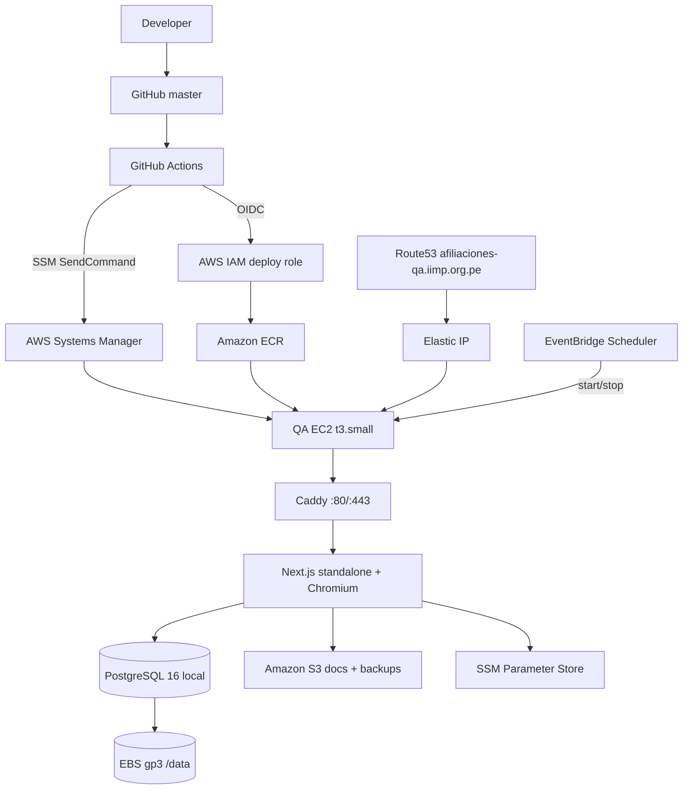

# QA — Arquitectura, despliegue y operación

> **Documento canónico del ambiente QA.** Fuente de verdad para arquitectura AWS, Terraform, CI/CD, Docker, costos, despliegue, rollback y operación de `afiliaciones-qa.iimp.org.pe`.
> Última actualización: 23 de septiembre de 2026.

---

## 1. Propósito

QA es un ambiente **aislado, de un solo nodo y de bajo costo** para validar la aplicación, las migraciones, la generación de PDF (Chromium/Puppeteer) y las integraciones **antes** de tocar el sistema legacy o producción.

- **Qué es:** una EC2 `t3.small` con Docker que ejecuta Caddy (HTTPS), la aplicación Next.js y PostgreSQL QA local.
- **Por qué existe:** detectar defectos de aplicación/infraestructura con datos de prueba, sin exponer usuarios reales ni el sistema actual.
- **Qué valida:** build, migraciones, PDF, HTTPS, health checks, integraciones externas en modo TEST.
- **Qué NO es:** no es producción, no replica producción, no comparte base de datos ni dominio con el sistema legacy (`afiliacion.iimp.org.pe`), no tiene alta disponibilidad.

---

## 2. Estado actual

| Capacidad | Estado |
| --- | --- |
| QA implementado | IMPLEMENTED |
| QA desplegado | DEPLOYED |
| CI/CD | OPERATIONAL |
| Terraform | OPERATIONAL |
| GitHub OIDC | OPERATIONAL |
| ECR | OPERATIONAL |
| SSM deploy | OPERATIONAL |
| EventBridge Scheduler | OPERATIONAL (ver §19, discrepancia de horario) |

Último despliegue confirmado:

- `WORKFLOW_RUN_ID = 35884214489` → `completed` / `success`.
- `WORKFLOW_HEAD_SHA = 746838c20e42ab1d23521ab57e95be0c707d26e4`.
- Imagen: `qa-746838c20e42ab1d23521ab57e95be0c707d26e4-35884214489-1`.
- `DATABASE_CHANGED = NO`, `MIGRATIONS_EXECUTED = NO`, `SEEDS_EXECUTED = NO`.

---

## 3. Diagrama de arquitectura



Flujo de tráfico: `Internet → Route53 → Elastic IP → EC2 → Caddy (TLS Let's Encrypt) → app:3000 → PostgreSQL (red interna Docker)`.

---

## 4. Inventario AWS

Recursos confirmados en `infra/terraform/environments/qa` y su módulo de origen.

| Servicio | Recurso (nombre lógico) | Propósito | Persistente | Terraform |
| --- | --- | --- | --- | --- |
| EC2 VPC | `afiliaciones-qa-vpc` (10.20.0.0/16) | Aislamiento de red | Sí | `network` |
| EC2 Subnet | `afiliaciones-qa-public-1` (10.20.0.0/24, us-east-2a) | Única subred pública | Sí | `network` |
| EC2 IGW | `afiliaciones-qa-igw` + route table | Salida/entrada pública | Sí | `network` |
| EC2 | `afiliaciones-qa-ec2` (t3.small, AL2023, IMDSv2) | Compute: Caddy + Docker | Sí | `ec2` |
| EC2 Elastic IP | `afiliaciones-qa-eip` | IP estable ante stop/start (destino DNS) | Sí | `ec2` |
| EBS | raíz 20 GB gp3 + datos 30 GB gp3 (`/data`) | Sistema + PostgreSQL/Docker | Sí (datos `delete_on_termination=false`) | `ec2` |
| Security Group | `afiliaciones-qa-ec2-sg` | 80/443 público; 5432 solo CIDR pgAdmin; sin SSH | Sí | `ec2` |
| ECR | `afiliaciones-qa-app` | Imágenes inmutables de la app | Sí | `ecr` |
| S3 | `afiliaciones-qa-docs-*` | Documentos + backups (`backups/`) | Sí (sigue al apagar EC2) | `storage` |
| CloudWatch | `/ecs/afiliaciones-qa-app` (7 días) | Logs de aplicación | Sí | `observability` |
| SSM Parameter Store | `/afiliaciones/qa/*` (String + SecureString) | Config no sensible + secretos | Sí | `ssm` |
| SSM Document | `AfiliacionesQaDeploy` | Rollout app-only inmutable | Sí | `github-actions-qa-deploy` |
| IAM | `afiliaciones-qa-ec2-role` (instance role) | Permisos mínimos de la instancia | Sí | `ec2` |
| IAM | `afiliaciones-qa-github-actions-deploy` (OIDC role) | CI/CD sin access keys | Sí | `github-actions-qa-deploy` |
| IAM | `afiliaciones-qa-scheduler-role` | start/stop de la EC2 | Sí | `scheduler` |
| EventBridge Scheduler | `afiliaciones-qa-start` / `afiliaciones-qa-stop` | Arranque/parada programada | Sí | `scheduler` |

**Módulos NO usados por QA** (conservados para producción futura, sin recursos creados): `alb`, `ecs`, `rds`, `iam` (ECS), `secrets` (Secrets Manager), `security` (ALB/ECS/RDS).

Sin ALB, sin NAT Gateway, sin ECS/Fargate, sin RDS, sin Secrets Manager, sin VPC endpoints.

---

## 5. Terraform

### Estructura

```text
infra/terraform/
  modules/            # alb, ec2, ecr, ecs, github-actions-qa-deploy, iam,
                      # network, observability, rds, scheduler, secrets,
                      # security, ssm, storage
  environments/qa/    # main.tf, variables.tf, outputs.tf, versions.tf,
                      # user_data.sh.tpl, terraform.tfvars (gitignored)
```

### Backend y estado

- Backend S3: bucket `iimp-afiliaciones-terraform-state-564914947461`, key `afiliaciones/qa/terraform.tfstate`, región `us-east-2`.
- `encrypt = true`, `use_lockfile = true` (locking nativo del backend S3, sin DynamoDB).
- El state es altamente sensible: nunca versionar secretos ni valores legibles en él.

### Comandos

| Comando | Qué hace | Quién lo ejecuta |
| --- | --- | --- |
| `terraform fmt -recursive` | Formato | Local / CI (`fmt -check`) |
| `terraform init -backend=false` | Init sin backend | CI (`quality-gates`) |
| `terraform validate` | Valida configuración | Local / CI |
| `terraform plan` | Plan read-only | Solo local con autorización |
| `terraform apply` | Aplica cambios | **Manual con autorización explícita** |

### Lo que el pipeline ejecuta (y NO ejecuta)

El workflow `qa-deploy.yml` ejecuta en `quality-gates`:

- `terraform fmt -check -recursive`
- `terraform init -backend=false -input=false`
- `terraform validate`

**NO ejecuta `terraform plan` ni `terraform apply`.** Hacer push a `master` **no** aplica cambios de infraestructura en AWS. Los cambios Terraform se aplican de forma **manual y autorizada** fuera del pipeline.

### Aplicación real (histórico)

- Primer `apply` (arquitectura Ultra-Lean): **35 add / 0 change / 0 destroy**.
- Corrección del role de deploy (ver §10): plan focalizado **0 add / 1 change / 0 destroy**, exclusivamente `ecr:BatchGetImage` sobre `module.github_actions_qa_deploy.aws_iam_role_policy.github_actions_qa_deploy`.

---

## 6. CI/CD completo

### Workflows

1. `.github/workflows/security.yml` — gates en `pull_request` y `push` a `master`.
2. `.github/workflows/qa-deploy.yml` — despliegue QA por `workflow_dispatch`.

### Flujo de despliegue QA (`qa-deploy.yml`)

```text
Developer
   ↓ git commit / git push origin master
GitHub (master)
   ↓ workflow_dispatch (confirm_deploy = true)
quality-gates (terraform fmt/validate, npm ci, prisma generate,
               secret scan, runtime deps, check, browser test, build)
   ↓
build-and-deploy
   ├─ Validate external deployment configuration (QA_DEPLOY_ROLE_ARN)
   ├─ Checkout requested revision
   ├─ Configure AWS credentials through OIDC
   ├─ Log in to Amazon ECR
   ├─ Set up Docker Buildx
   ├─ Resolve immutable image reference (tag qa-<sha>-<run>-<attempt>)
   ├─ Build and push immutable QA image
   ├─ Verify image is available in ECR (digest match)
   └─ Deploy only the app service through SSM (poll hasta Success)
```

### El pipeline QA NO hace automáticamente

```text
NO terraform plan / apply / destroy
NO migraciones de base de datos
NO seeds
NO deploy a producción
NO cambios de DNS de producción
NO cambios de infraestructura al hacer push
```

Un build verde **no** implica que Terraform se aplicó, ni que la base de datos se migró, ni que el deploy llegó a QA.

---

## 7. Quality gates

Confirmados contra los workflows reales.

| Gate | Propósito | Bloquea deploy |
| --- | --- | --- |
| `terraform fmt -check` | Consistencia de formato IaC | Sí (quality-gates) |
| `terraform init -backend=false` | Init válido sin backend | Sí |
| `terraform validate` | Configuración Terraform válida | Sí |
| `npm ci` | Dependencias reproducibles | Sí |
| `npx prisma generate` | Genera Prisma Client | Sí |
| `npm run security:secrets` | Escaneo de secretos commiteados | Sí |
| `npm run security:runtime` | Advisories CRITICAL/HIGH del árbol desplegable | Sí (blocking) |
| `npm run check` | TypeScript strict + ESLint bloqueante + Vitest | Sí |
| Browser test `/consulta` | UI inicial real en Chromium | Sí |
| `npm run build` | Build de producción Next.js | Sí |
| `security:dependencies` (full audit) | Auditoría completa (incl. dev) | No (reporting) |
| Docker artifact (security.yml) | Imagen corre, fail-fast, smoke, sandbox | Sí (en `security.yml`, no en el deploy) |

La referencia de los gates de código sigue en [QUALITY_GATES.md](QUALITY_GATES.md).

---

## 8. Incidente CI: DATABASE_URL sintética

`npx prisma generate` fallaba en CI porque `DATABASE_URL` es obligatoria al cargar la configuración de Prisma, aunque la generación **no** necesita conexión real.

- Se resolvió con una `DATABASE_URL` sintética definida **solo** en el job `quality-gates`: `postgresql://ci@127.0.0.1:1/ci?schema=public`.
- `synthetic URL != QA database`: no hay conexión, no hay credenciales reales, no se modifica ninguna base de datos.

No confundir con `DATABASE_URL` real de QA, que vive en SSM Parameter Store (SecureString).

---

## 9. Incidente CI: Chromium en el runner de GitHub

El browser test (`modules/afiliaciones/consulta/Tests/ConsultaInitialState.browser.mjs`) falló en GitHub Actions porque Chromium no encontraba un sandbox utilizable en el runner.

Solución aplicada (solo en CI):

```js
args: process.env.CI === "true" ? ["--no-sandbox", "--disable-setuid-sandbox"] : []
```

- Aplica **exclusivamente** al runner de GitHub Actions.
- **No** se confunde con la estrategia de sandbox del contenedor QA (ver §18): en QA runtime el sandbox de Chromium **está habilitado** con perfil seccomp mínimo; no se usa `--no-sandbox`.

---

## 10. Incidente CI: `ecr:BatchGetImage`

Buildx falló porque el role `afiliaciones-qa-github-actions-deploy` no tenía `ecr:BatchGetImage`.

Corrección en Terraform: se agregó únicamente `ecr:BatchGetImage` al statement `PushAndInspectOnlyQaApplicationRepository`, cuyo `Resource` es el ARN del repositorio QA. **No** se usó `ecr:*` ni `Resource = "*"`.

Principio: mínimo privilegio. Ver [módulo github-actions-qa-deploy](../../infra/terraform/modules/github-actions-qa-deploy/main.tf).

---

## 11. Incidente: Terraform drift en el role EC2

Durante un `plan` apareció `PLAN_CHANGE = 2`: además del cambio ECR, Terraform proponía modificar `module.ec2.aws_iam_role_policy.instance`.

Diagnóstico: **drift** entre código Terraform (y state) y la política efectiva en AWS. El código y el state coincidían; AWS tenía permisos adicionales aplicados **fuera de Terraform** (scope SSM más amplio, `kms:Decrypt`, `sns:Publish`).

Lección operacional:

> Nunca aplicar ciegamente un `terraform plan` que contenga recursos inesperados.

Se aplicó solo un plan focalizado sobre `module.github_actions_qa_deploy.aws_iam_role_policy.github_actions_qa_deploy` (0/1/0, solo `ecr:BatchGetImage`). El drift del role EC2 **queda pendiente de investigación/reconciliación** (no se corrige en esta fase).

---

## 12. GitHub OIDC

```text
GitHub Actions → OIDC (token.actions.githubusercontent.com) → AWS IAM Role → credenciales temporales
```

- **No** se usan access keys permanentes en GitHub para el deploy.
- El role `afiliaciones-qa-github-actions-deploy` tiene una trust policy `sts:AssumeRoleWithWebIdentity` restringida a:
  - `aud = sts.amazonaws.com`;
  - `sub = repo:iimp-projects@277050971/new-afiliaciones-iimp@1304167655:environment:qa` (subject inmutable).
- Sesión de corta duración (max 3600 s), limitada al ambiente `qa`.
- Permisos mínimos del role: `ecr:GetAuthorizationToken` (región), push/inspect sobre el repo QA, `ssm:SendCommand` (solo el documento `AfiliacionesQaDeploy` y la instancia QA exacta) y `ssm:GetCommandInvocation`.

**Diferencia con el role de EC2:** el role GitHub (OIDC) solo publica imágenes y ordena el deploy; el role EC2 (`afiliaciones-qa-ec2-role`) es el que la instancia usa en runtime para S3, SSM, logs y pull de ECR.

---

## 13. ECR

- Repositorio: `afiliaciones-qa-app` (tags inmutables: `image_tag_mutability = IMMUTABLE`; lifecycle de limpieza de imágenes sin tag y de imágenes antiguas).
- Escaneo on push; cifrado AES256.

### Tagging inmutable

Formato: `qa-<commit-sha>-<workflow-run-id>-<attempt>`.

Ejemplo: `qa-746838c20e42ab1d23521ab57e95be0c707d26e4-35884214489-1`.

Trazabilidad: el tag permite saber, sin ambigüedad, qué commit se desplegó y con qué run/attempt. **Nunca** se usa `:latest` para QA.

---

## 14. Despliegue por SSM (sin SSH)

```text
GitHub Actions → AWS OIDC → SSM SendCommand (AfiliacionesQaDeploy) → EC2 QA
  → docker login ECR → docker pull <imagen> → docker compose up -d app
  → health check → smoke HTTP
```

- El documento SSM `AfiliacionesQaDeploy` valida el `ImageUri` contra el patrón del repo QA (rechaza cualquier URI que no sea una imagen inmutable esperada).
- No usa SSH público: la administración es por SSM (Session Manager / SendCommand), SG sin puerto 22.
- El step de CI **hace polling** de `get-command-invocation` hasta `Success`; solo `Success` sale con código 0.
- Si SSM falla, el documento **revierte** al contenedor `app` anterior (`rollback_app`) y reintenta el health check.
- Un **build exitoso ≠ deploy exitoso**: el push a ECR puede funcionar y el deploy por SSM fallar.

---

## 15. Docker

- `Dockerfile` multi-stage: `deps` (npm ci + Chromium de Puppeteer) → `builder` (Prisma Client + build Next.js standalone) → `runner` (imagen final non-root) y `migration` (one-shot Prisma CLI).
- Runtime: Next.js `standalone`, usuario `nextjs` (uid 1001, non-root), `tini` como PID 1, `HEALTHCHECK` sobre `/api/health/live`.
- Chromium: descargado por Puppeteer durante `npm ci` y copiado al runner; helper `chrome_sandbox` con setuid (4755, root).
- No hay Prisma CLI ni migraciones ni seeds en la imagen web en runtime.
- Compose en la instancia (`/opt/afiliaciones-qa`): servicios `caddy`, `app`, `postgres`; redes `edge` (Caddy↔app) y `data` (app↔postgres); volúmenes `pgdata` (bind a `/data/postgres`), `caddy_data`, `caddy_config`; `restart: unless-stopped`. El compose no está versionado en el repositorio (vive en la instancia).

> Nota: la `docker-compose.yml` no está en el repo; la gestiona el bootstrap (`user_data.sh.tpl`) y el documento SSM en `/opt/afiliaciones-qa`.

---

## 16. PostgreSQL QA

- PostgreSQL 16 en **contenedor local**, red interna Docker (`postgres:5432`), **no** publicado al host ni a Internet.
- Datos en el volumen EBS de 30 GB montado en `/data/postgres` (persistente; `delete_on_termination=false`).
- `pg_dump` diario (cron en host) → comprimido → S3 `backups/` (cifrado, versioning, lifecycle).
- Al apagar/reiniciar la EC2, los datos persisten en el volumen EBS; al arrancar, el stack levanta con los mismos datos.
- Aislado de producción; no comparte credencial ni schema con el sistema legacy.
- Migraciones: imagen `migration` (con Prisma CLI) ejecutada como one-shot (`prisma migrate deploy`); **nunca** al arrancar la app.
- Acceso directo para operación (pgAdmin): habilitado por SG en TCP/5432 restringido a un pool NAT `/24` (valor en `qa_postgres_allowed_cidr`), nunca `0.0.0.0/0`.

---

## 17. HTTPS / Caddy

- Caddy en `:80`/`:443`, HTTPS automático con **Let's Encrypt** (no ACM), redirección HTTP→HTTPS, proxy a `app:3000`.
- Cabeceras `X-Forwarded-For`/`X-Forwarded-Proto`/`Host` hacia el backend. Deuda conocida: el código confía en el valor izquierdo de `X-Forwarded-For`; con Caddy como único proxy debe configurar `trusted_proxies` y sobrescribir la cabecera (`MUST_FIX_BEFORE_PRODUCTION`).
- DNS: `afiliaciones-qa.iimp.org.pe` (A) → Elastic IP.

---

## 18. Chromium en runtime QA (perfil seccomp mínimo)

**Problema:** Chromium necesita `unshare`/`clone` con flags de namespace (sandbox de namespaces). El perfil seccomp por defecto de Docker solo los permite con `CAP_SYS_ADMIN`; el contenedor `app` es non-root y sin `CAP_SYS_ADMIN`, por lo que `unshare(CLONE_NEWUSER)` → `EPERM` y Chromium abortaba ("No usable sandbox").

**Solución final (sin reducir la seguridad global):**

- Se parte del perfil seccomp por defecto de Docker y se **antepone una única regla** que permite `unshare` y `clone`:

```json
{ "names": ["unshare", "clone"], "action": "SCMP_ACT_ALLOW" }
```

- Generación reproducible en el host QA:

```bash
curl -sSL https://raw.githubusercontent.com/moby/profiles/main/seccomp/default.json -o default-seccomp.json
jq '.syscalls = ([{"names":["unshare","clone"],"action":"SCMP_ACT_ALLOW"}] + .syscalls)' \
   default-seccomp.json > /opt/afiliaciones-qa/qa-app-seccomp.json
```

- Se aplica **solo** al servicio `app` (no a `postgres`/`caddy`, no global):

```yaml
  app:
    shm_size: "512mb"
    security_opt:
      - seccomp:/opt/afiliaciones-qa/qa-app-seccomp.json
```

- El contenedor sigue siendo **non-root**, **sin `CAP_SYS_ADMIN`**, **sin `privileged`**, **sin `seccomp=unconfined`**. Chromium mantiene su sandbox interno.

**Distinción clave:**

| Aspecto | Runner GitHub (CI) | Contenedor QA (runtime) |
| --- | --- | --- |
| Solución | `--no-sandbox --disable-setuid-sandbox` si `CI=true` | Perfil seccomp mínimo (`unshare`,`clone`) |
| Sandbox Chromium | Deshabilitado | Habilitado |
| Alcance | Solo tests CI | Solo contenedor `app` QA |

No se recomienda desactivar la seguridad del contenedor; `--no-sandbox` no es aceptable para el runtime QA.

---

## 19. Scheduler (EventBridge Scheduler)

Propósito: apagar la EC2 fuera de horario para reducir costo.

### Discrepancia detectada (no corregida en esta fase)

| | Documentado/histórico | **Real (Terraform + AWS)** |
| --- | --- | --- |
| Días | Lunes–Viernes | Start **MON–SAT** |
| Start | 08:00 | `cron(0 8 ? * MON-SAT *)` America/Lima |
| Stop | 20:00 | `cron(0 1 ? * TUE-SUN *)` America/Lima (01:00) |

Recursos confirmados en AWS (ENABLED):

- `afiliaciones-qa-start` → `startInstances`, `cron(0 8 ? * MON-SAT *)`, America/Lima.
- `afiliaciones-qa-stop` → `stopInstances`, `cron(0 1 ? * TUE-SUN *)`, America/Lima.

Consecuencia: el horario real incluye el sábado (start 08:00) y la parada ocurre a la **01:00**, no a las 20:00. Esto produce más horas de cómputo que el horario "L-V 08:00–20:00" previsto. **Queda pendiente reconciliar las expresiones cron con la intención documentada.** (Terraform: `enable_scheduler = true` en `terraform.tfvars` gitignored.)

- Qué enciende/apaga: `startInstances` / `stopInstances` sobre la EC2 QA exacta (vía role `afiliaciones-qa-scheduler-role`).
- Qué persiste al apagar: EBS, Elastic IP, S3, ECR, CloudWatch, SSM, IAM.
- Qué sigue costando con EC2 apagada: EBS (50 GB), Elastic IP, S3, ECR, CloudWatch, EventBridge Scheduler (invocaciones).
- Fines de semana: con la configuración actual la instancia **sí** arranca el sábado (start MON–SAT) y se detiene el domingo a la 01:00.

Para modificar el horario (conceptual, no ejecutar sin autorización): editar `start_schedule`/`stop_schedule`/`scheduler_timezone` en `variables.tf` (o `terraform.tfvars`), validar con `plan` y aplicar con autorización explícita.

---

## 20. Costos (ESTIMACIÓN)

> **ESTIMACIÓN**, no cotización. Los precios varían por tráfico, logs, storage, requests, data transfer e impuestos. Región `us-east-2`. Precios on-demand verificados vía AWS Pricing API (2026-09-01).

| Componente | Configuración | USD/mes |
| --- | --- | ---: |
| EC2 t3.small | $0.0208/h | horario ≈ $5.41 · 24x7 $15.18 |
| EBS gp3 | raíz 20 GB + datos 30 GB, $0.08/GB-mo | $4.00 |
| Elastic IPv4 | $0.005/h | $3.65 |
| S3 | docs + backups (~5 GB) + requests | ≈ $0.15 |
| ECR | ~2 GB, $0.10/GB-mo | ≈ $0.20 |
| CloudWatch | ingest + storage (7 días) | ≈ $0.50 |
| SSM Parameter Store | estándar + SecureString | $0.00 |
| EventBridge Scheduler | 2 schedules, pocas invocaciones | ≈ $0.00 |
| Data transfer | variable, bajo | variable |

- **TOTAL QA horario laboral previsto (≈260 h/mes): ≈ USD 14 / mes.**
- **TOTAL QA 24x7 (730 h/mes): ≈ USD 24 / mes.**
- Ahorro mensual ≈ USD 9.8 · anual ≈ USD 117 (frente a 24x7).

> Nota: el horario real del scheduler (§19) produce más horas de cómputo que los 260 h/mes previstos; el EC2 real tenderá a estar entre el escenario horario y el 24x7 hasta reconciliar las expresiones cron.

Recursos que **siguen generando costo con la EC2 apagada**: EBS, Elastic IPv4, S3, ECR, CloudWatch, EventBridge Scheduler.

Conversión a PEN: **referencial**; no se fija una tasa. Fuentes de precios oficiales:

- [Amazon EC2 on-demand pricing](https://aws.amazon.com/ec2/pricing/on-demand/)
- [Amazon EBS pricing](https://aws.amazon.com/ebs/pricing/)
- [Amazon VPC pricing (public IPv4)](https://aws.amazon.com/vpc/pricing/)
- [Amazon S3 pricing](https://aws.amazon.com/s3/pricing/)
- [Amazon ECR pricing](https://aws.amazon.com/ecr/pricing/)
- [Amazon CloudWatch pricing](https://aws.amazon.com/cloudwatch/pricing/)

---

## 21. QA Deployment — End to End

```text
Developer local
   ↓ git add / git commit
   ↓ git push origin master
GitHub master (HEAD = <sha>)
   ↓ Manual: Actions → "Deploy QA" → Run workflow (confirm_deploy = true)
quality-gates (fmt, init, validate, npm ci, prisma generate, secret scan,
               runtime deps, check, browser test, build)
   ↓
OIDC → IAM role → credenciales temporales
   ↓
ECR login → Buildx → docker build (NEXT_PUBLIC_APP_URL=QA_URL)
   ↓
ECR push (qa-<sha>-<run>-<attempt>)
   ↓
Verify digest in ECR
   ↓
SSM SendCommand (AfiliacionesQaDeploy) → EC2
   ↓
docker pull → docker compose up -d app → health + smoke
   ↓
QA en https://afiliaciones-qa.iimp.org.pe
```

Verificación segura (read-only):

```bash
git rev-parse HEAD                          # SHA local
git rev-parse origin/master                 # SHA GitHub (tras fetch)
```

Para el SHA desplegado: la imagen en ejecución (tag `qa-<sha>-<run>-<attempt>`) y el tag ECR embeben el commit. Ver §22.

---

## 22. Paridad Local / GitHub / QA

Condición ideal:

```text
LOCAL_SHA == GITHUB_MASTER_SHA == QA_DEPLOYED_SHA
```

Distinguir:

- **HEAD parity**: el commit de `master` local, de `origin/master` y el desplegado coinciden.
- **Working tree parity**: `git status --short` está limpio.

Un working tree con archivos locales no versionados (tooling como `.agents/`, `opencode.json`, `skills-lock.json`, `CLAUDE.md`, `GEMINI.md`) produce `HEAD parity = YES` pero `working tree clean = NO`. Eso **no** significa que QA tenga código distinto.

Verificación del SHA desplegado (read-only, sin redeploy):

```bash
aws ecr describe-images --repository-name afiliaciones-qa-app --region us-east-2 \
  --query 'sort_by(imageDetails,&imagePushedAt)[-1].imageTags' --output text
```

o inspeccionando el contenedor en ejecución (read-only). El SHA está embebido en el tag.

---

## 23. Rollback (conceptual, no ejecutar aquí)

No se usa `:latest`; cada imagen es inmutable e identificable por `qa-<sha>-<run>-<attempt>`.

1. Identificar la imagen anterior: `aws ecr describe-images` (lista de tags con fecha de push).
2. Identificar el SHA del commit deseado a partir del tag.
3. Restaurar: ordenar al documento SSM (o `docker compose` con override de imagen) que apunte a la imagen anterior, replicando el mecanismo de `rollback_app` que ya tiene `AfiliacionesQaDeploy`.
4. Verificar: `/api/health/live`, `/api/health/ready`, y el tag en ejecución.

El documento SSM ya implementa rollback automático a la imagen previa si el health check falla durante el rollout.

---

## 24. Troubleshooting

| Problema | Causa probable | Diagnóstico | Acción |
| --- | --- | --- | --- |
| `prisma generate` falla en CI | `DATABASE_URL` obligatoria al cargar config | Error de carga de config en `quality-gates` | Usar `DATABASE_URL` sintética en CI (ya aplicado) |
| Browser test falla en runner | Chromium sin sandbox utilizable | "No usable sandbox" | `--no-sandbox` solo si `CI=true` (ya aplicado) |
| Buildx falla al push | Falta `ecr:BatchGetImage` | Error IAM en build-and-deploy | Añadir `ecr:BatchGetImage` al role (ya aplicado) |
| OIDC AssumeRole falla | Subject/aud del role mal configurado | "AccessDenied" en `configure-aws-credentials` | Verificar trust policy (aud + sub) |
| Docker build falla | Dependencias/chromium/libs | Log de build | Revisar stage/`PUPPETEER_CACHE_DIR` |
| ECR push falla | Auth/permisos/región | Error de `docker push` | Verificar ECR login y policy |
| SSM deploy falla | Documento/instancia/imagen | `get-command-invocation` status | Revisar output del documento; verifica rollback automático |
| Contenedor unhealthy | App sin arrancar/config faltante | `docker inspect` Health | Ver `docker logs`, secretos SSM |
| PostgreSQL no responde | Volumen/contenedor | `docker compose ps` / logs | Verificar montaje `/data/postgres` |
| Caddy/HTTPS | DNS/ACME/puertos | `curl` / logs de Caddy | Verificar EIP, DNS A, 80/443 en SG |
| Scheduler no apaga/arranca | Expresión cron/timezone/role | `aws scheduler get-schedule` | Verificar cron, timezone, role |
| Terraform drift | Cambios fuera de Terraform | `terraform plan` con cambios inesperados | Investigar por separado; no aplicar a ciegas |

---

## 25. Seguridad

Controles confirmados:

- GitHub OIDC (sin access keys permanentes para el deploy).
- IAM de mínimo privilegio por rol (GitHub deploy, instance, scheduler).
- SG solo 80/443 público; sin 22/3000/5432 desde Internet (5432 restringido a un pool `/24`).
- S3 privado (Block Public Access, cifrado AES256, versioning, BucketOwnerEnforced).
- SSM Parameter Store SecureString para secretos; valores **fuera** de Terraform/Git/imagen/state.
- Imágenes ECR inmutables y con scan on push.
- IMDSv2 obligatorio en la instancia.
- EBS cifrado (root y datos).
- Escaneo de secretos commiteados + gate de dependencias runtime en CI.
- Chromium con sandbox habilitado (perfil seccomp mínimo, non-root).

Deudas/limitaciones conocidas (documentadas, no resueltas aquí): `X-Forwarded-For` (configurar `trusted_proxies`), PII en logs de aplicación, drift del role EC2.

---

## 26. Producción

Pendiente de diseño e implementación.

La arquitectura, costos, estrategia de migración y CI/CD de producción serán documentados después de su implementación y validación.

No asumir que producción será una copia exacta de QA.

Las propuestas productivas existentes en [AWS_ARCHITECTURE.md](AWS_ARCHITECTURE.md) son material de planificación, **no** infraestructura implementada.

---

## 27. Historial de implementación y decisiones

Resumen de decisiones que llevaron a la arquitectura actual (detalle histórico consolidado):

- La arquitectura QA original propuesta (ALB + ECS Fargate + NAT + RDS + 2 AZ) fue descartada por estar sobredimensionada para 20–30 usuarios/día (~USD 115–185/mes).
- Se adoptó **Ultra-Lean**: EC2 `t3.small` única, Caddy, PostgreSQL local, S3, ECR, SSM, CloudWatch 7 días. Sin ALB/NAT/ECS/RDS.
- Sizing: benchmark local mostró que 2 GB de RAM son suficientes (2 PDFs concurrentes bajo ~512 MiB cgroup; peak ~359 MiB). `t3.micro` (1 GB) descartado por riesgo OOM; `t3.medium` sobredimensionado.
- Primer `apply`: **35 recursos**, 35/0/0. Despliegue inicial con Caddy + Next.js + PostgreSQL; 26 migraciones aplicadas; backup `pg_dump` → S3.
- Chromium: bloqueado inicialmente por el perfil seccomp de Docker; resuelto con perfil seccomp mínimo (`unshare`,`clone`) sin reducir la seguridad global.
- CI/CD: se agregó `security.yml` (gates) y `qa-deploy.yml` (workflow_dispatch + OIDC + ECR + SSM).

### Documentos funcionales QA (historial de aplicación, fuera del alcance de infraestructura)

- `qa-functional-data-and-integrations-audit.md` — auditoría de datos/catálogos e integraciones (RENIEC/SUNAT).
- `qa-functional-remediation-report.md` — remediación funcional (catálogos + token APIS.NET.PE).
- `qa-upload-authorization-remediation.md` — bug 401 en upload de postulación.
- `qa-upload-401-deployment-validation.md` — deploy y revalidación del fix de upload.
- `qa-otp-integrations-audit.md` / `qa-otp-integrations-remediation.md` — integraciones OTP (WhatsApp/SMS/Email).
- `qa-test-users-restoration.md` — restauración de usuarios de prueba del seed.
- `qa-finops-and-existing-infrastructure-analysis.md` — FinOps e inventario del sistema legacy (contexto, no infraestructura QA).

---

## 28. Referencias

- Terraform: [infra/terraform/README.md](../infra/terraform/README.md).
- Workflows: [qa-deploy.yml](../.github/workflows/qa-deploy.yml), [security.yml](../.github/workflows/security.yml).
- Dockerfile: [Dockerfile](../Dockerfile).
- Gates de código: [QUALITY_GATES.md](QUALITY_GATES.md).
- Propuestas productivas: [AWS_ARCHITECTURE.md](AWS_ARCHITECTURE.md).
