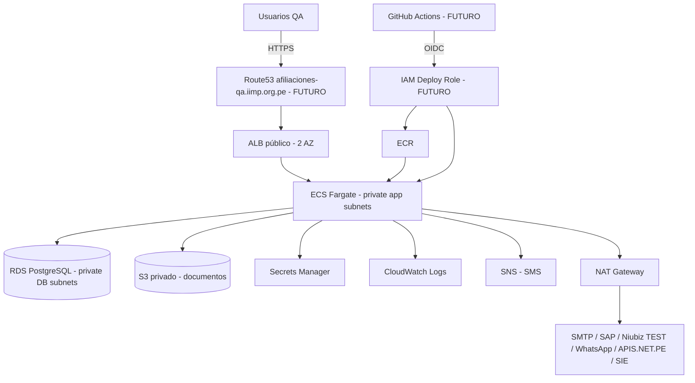

# Arquitectura QA — Sistema de Afiliaciones IIMP

> **PRICING_REFERENCE_DATE:** 2026-09-20
> **AWS_REGION:** us-east-2 (US East — Ohio)
> **CURRENCY:** USD
> **PEN_CONVERSION:** REFERENTIAL
>
> Esta estimación no constituye una cotización de AWS. El consumo real depende del
> tráfico, almacenamiento, logs, transferencia de datos y uso de servicios externos.
> Los precios AWS cambian; verificar antes de aprobar presupuesto.

---

## Resumen para aprobación

**¿Qué vamos a crear?**
Un entorno **QA nuevo y aislado** en AWS para el sistema de Afiliaciones IIMP: una VPC
dedicada, un balanceador (ALB), contenedores (ECS Fargate) con la aplicación Next.js,
una base de datos PostgreSQL (RDS), almacenamiento S3, secretos administrados,
logs y un registro ECR para imágenes.

**¿Dónde?**
Cuenta AWS IIMP actual, región **us-east-2**, con recursos nombrados `afiliaciones-qa-*`.

**¿Afectará producción?**
**No.** QA es infraestructura nueva. No se toca el sistema legacy, ni
`afiliacion.iimp.org.pe`, ni DNS, ni bases de datos, ni buckets, ni certificados
existentes. El hostname QA previsto es `afiliaciones-qa.iimp.org.pe` (registro no creado aún).

**¿Cuánto costará aproximadamente?**
Entre **≈ USD 119 y USD 184 / mes** según actividad (≈ S/ 440 a S/ 681 referencial),
más el consumo de servicios externos (correo, Niubiz, SAP, WhatsApp, APIS.net.pe, SIE).

**¿Cuáles son los principales costos?**
NAT Gateway (~USD 33/mes), Fargate (~USD 36/mes), ALB (~USD 16/mes), RDS (~USD 13/mes).

**¿Qué seguridad tendrá?**
ALB es el único punto público; ECS y RDS privados; sin SSH/RDP; PostgreSQL no público;
S3 privado con Block Public Access; IAM de mínimo privilegio; secretos en Secrets
Manager (sin valores en Terraform).

**¿Qué falta validar?**
Certificado ACM, backend Terraform, rol CI/OIDC, valores de secretos, validación real
de Chromium en Fargate y la ejecución de migraciones.

**¿Qué autorización necesitamos?**
Autorización humana explícita para ejecutar `terraform apply` (FASE 3D-6), tras aprobar
arquitectura y costos.

---

## 1. Resumen ejecutivo

El sistema de Afiliaciones IIMP se desplegará primero en un entorno **QA aislado**, con
infraestructura nueva, reproducible (Terraform) y separada del sistema actual. El objetivo
es validar aplicación, base de datos, migraciones, generación de PDFs (Chromium) e
integraciones **antes** de considerar cualquier reemplazo del sistema legacy.

La arquitectura es un monolito modular Next.js en contenedores (ECS Fargate) detrás de un
ALB, con PostgreSQL administrado (RDS), almacenamiento de documentos en S3 y secretos en
Secrets Manager. El acceso a Internet de los contenedores se realiza mediante un NAT
Gateway para integraciones externas. La base de datos y los contenedores permanecen en
subredes privadas, sin exposición pública directa.

QA **no** modifica el sistema actual ni el dominio de producción.

## 2. Objetivo

- Desplegar un entorno QA funcional y aislado.
- Validar infraestructura, aplicación, migraciones, PDFs e integraciones.
- Mantener separación total respecto de legacy/producción.
- Preparar la base para una futura fase de producción (fuera de alcance).

## 3. Alcance

**Incluido:** VPC, subredes, NAT, ALB, ECS Fargate, RDS PostgreSQL, S3, ECR, Secrets
Manager, CloudWatch, IAM, ACM (futuro), Route53 (futuro), migration task.

**Excluido:** cutover de producción, migración de datos legacy, cambios de DNS legacy,
reemplazo del sistema actual, WAF/Shield, multi-región, alta disponibilidad productiva.

## 4. Arquitectura general



Clasificación visual:
- **PUBLIC:** ALB (y Route53 futuro).
- **PRIVATE APP:** ECS Fargate, VPC endpoints.
- **PRIVATE DATABASE:** RDS.
- **EXTERNAL SERVICES:** SMTP, SAP, Niubiz TEST, WhatsApp, APIS.NET.PE, SIE (vía NAT).

## 5. Inventario AWS

| Componente | Servicio AWS | Cantidad | Configuración QA | Público/Privado | Función |
|---|---|---|---|---|---|
| VPC | EC2 VPC | 1 | 10.20.0.0/16, DNS hostnames | Privada (lógica) | Aislamiento de red |
| Subnets públicas | EC2 Subnet | 2 | /20, 2 AZ | Público | ALB, NAT |
| Subnets privadas app | EC2 Subnet | 2 | /20, 2 AZ | Privado | ECS |
| Subnets privadas DB | EC2 Subnet | 2 | /20, 2 AZ | Privado | RDS |
| Internet Gateway | EC2 IGW | 1 | — | Público | Salida/entrada del ALB |
| NAT Gateway | EC2 NAT | 1 | single | Privado→Internet | Egress de ECS |
| Elastic IP | EC2 EIP | 1 | — | Público | NAT |
| Route tables | EC2 RouteTable | 5 | públicas/app/db | — | Enrutamiento |
| VPC Endpoint S3 | EC2 VPCE (Gateway) | 1 | — | Privado | S3 sin NAT |
| Security Groups | EC2 SG | 3 | alb/ecs/rds | — | Segmentación |
| ALB | ELBv2 | 1 | internet-facing | Público | Entrada HTTPS |
| Target Group | ELBv2 | 1 | ip:3000 | Privado | ECS targets |
| Listeners | ELBv2 | 2 | 80 (redirect), 443 | Público | HTTP/HTTPS |
| ECS Cluster | ECS | 1 | Container Insights | Privado | Cómputo |
| ECS Service | ECS | 1 | 1 task | Privado | Aplicación |
| Task Definitions | ECS | 2 | web + migration | Privado | Web y migración |
| ECR | ECR | 1 | immutable, scan | Privado | Imágenes |
| RDS | RDS | 1 | db.t4g.micro, Single-AZ | Privado | PostgreSQL |
| S3 | S3 | 1 | privado, versionado | Privado | Documentos |
| Secrets Manager | Secrets | 13 | contenedores | Privado | Secretos |
| CloudWatch | Logs | 1 | 30 días | Privado | Logs |
| IAM Roles | IAM | 4 | exec/task/migration/composer | — | Permisos |
| ACM | ACM | 1 (futuro) | afiliaciones-qa.iimp.org.pe | Público | TLS |
| Route53 record | Route53 | 1 (futuro) | — | Público | DNS |

> Plan Terraform vigente: **82 add / 0 change / 0 destroy**.

## 6. Especificaciones técnicas

### VPC / Red
- CIDR `10.20.0.0/16`; 2 AZ (`us-east-2a`, `us-east-2b`).
- Subredes: públicas, privadas de aplicación y privadas de base de datos.
- 1 Internet Gateway; 1 NAT Gateway (single); route tables dedicadas.
- VPC Endpoint Gateway de S3 (sin costo fijo). Interface endpoints diferidos en QA.

### ALB
- internet-facing; listeners 80 (redirect a 443) y 443 (HTTPS).
- target type `ip`, puerto 3000, health check `/api/health/live` (matcher 200).
- certificado ACM regional (futuro).

### ECS Fargate
- CPU **1024** (1 vCPU), memoria **2048 MB** (2 GB), 1 task, `X86_64`, Linux.
- `assign_public_ip=false`; subredes privadas app; SG ECS.
- Health check de contenedor `/api/health/live`; grace period 60 s.
- Deployment circuit breaker con rollback.

### RDS
- PostgreSQL **16**; `db.t4g.micro`; Single-AZ; gp3 20 GB (autoscaling hasta 100 GB).
- `storage_encrypted=true`; `publicly_accessible=false`; backup retention 7 días.
- `manage_master_user_password=true`; subredes privadas DB; SG exclusivo.

### S3
- privado, Block Public Access (4 flags), ownership `BucketOwnerEnforced`,
  SSE AES256, versionado, lifecycle de versiones no actuales (90 días).

### ECR
- 1 repositorio, tags inmutables, scan on push, lifecycle de imágenes antiguas.

### Secrets Manager
- 13 contenedores (sin valores): `auth-secret`, `payment-auth-secret`, `jwt-secret`,
  `database-url`, `smtp-pass`, `whatsapp-access-token`, `sap-password`,
  `apis-net-pe-token`, `associates-api-password`, `niubiz-test-username`,
  `niubiz-test-password`, `niubiz-prod-username`, `niubiz-prod-password`.

### CloudWatch
- 1 log group `/ecs/afiliaciones-qa-app`, retención 30 días.

### IAM
- **Execution Role:** pull ECR + logs + `GetSecretValue` de secretos inyectados.
- **Task Role:** `s3:GetObject`/`PutObject` (prefijo `afiliaciones/*`) y `sns:Publish` (SMS).
- **Migration Role:** execution policy + `GetSecretValue`.
- **Database URL Composer Role:** leer secreto de RDS + escribir `database-url`.
- **GitHub OIDC Role (futuro):** CI/CD sin access keys.

## 7. Arquitectura de red

Matriz de seguridad:

| Origen | Destino | Puerto | Permitido | Motivo |
|---|---|---|---|---|
| Internet | ALB | 80, 443 | Sí | Entrada pública |
| ALB | ECS | 3000 | Sí | Forward |
| ECS | RDS | 5432 | Sí (SG→SG) | PostgreSQL |
| ECS | Internet | 443 | Sí | APIs AWS/externas |
| ECS | Internet | 80 | Sí | Endpoints heredados |
| ECS | Internet | 25/465/587 | Sí | SMTP |
| ECS | S3 | 443 | Sí (endpoint) | Documentos |
| ECS | Secrets Manager | 443 | Sí (vía NAT) | Secretos |
| ECS | SNS | 443 | Sí (vía NAT) | SMS |
| Internet | ECS directo | — | **No** | Privado |
| Internet | RDS | 5432 | **No** | Privado |
| Cualquiera | 22 / 3389 | — | **No** | Sin SSH/RDP |

## 8. Seguridad

- ALB único punto de entrada público; ECS y RDS en subredes privadas.
- RDS `publicly_accessible=false`; sin `0.0.0.0/0` a PostgreSQL.
- S3 Block Public Access; cifrado; sin exposición pública.
- IAM de mínimo privilegio (sin `Action="*"`; única excepción `sns:Publish` por SMS directo).
- Sin credenciales estáticas; AWS SDK usa la cadena por defecto / IAM Role.
- Secretos en Secrets Manager; valores fuera de Terraform.

## 9. Gestión de secretos

```
RDS (manage_master_user_password)
  → secreto gestionado por RDS
  → rol database-url-composer
  → Secrets Manager `database-url` (AWSCURRENT)
  → ECS execution role (secrets.valueFrom)
  → variable DATABASE_URL en el contenedor
```

- Terraform crea **contenedores**, no valores.
- Terraform **no** almacena el password de RDS.
- Los valores se cargan fuera del repositorio (Secrets Manager).
- `SECRETS_IN_TERRAFORM_STATE = NO_BY_DESIGN`.

## 10. Base de datos

- PostgreSQL 16 en RDS, privado, cifrado, Single-AZ (QA).
- `DATABASE_URL` compuesta en runtime; `sslmode=require`.
- Migraciones mediante tarea one-shot separada (`prisma migrate deploy`).
- Backups automáticos (7 días); sin `deletion_protection` en QA.

## 11. Contenedores

- **Web image:** Next.js standalone, non-root, tini, Chromium, Prisma Client,
  sin Prisma CLI. Tamaño ≈ 1.24 GB.
- **Migration image:** Prisma CLI 6.19.3 + schema + migrations, non-root, sin Chromium.
  Tamaño ≈ 400 MB.
- Ambas sin `.env`, sin `.git`, sin credenciales.

## 12. Generación de PDFs

- Puppeteer 25.3.0 + Chrome for Testing 150.0.7871.24 (linux/x86_64).
- Chromium gestionado, sandbox habilitado (setuid), `tini` como PID 1.
- `LOCAL_DOCKER_VALIDATED = YES`; `FARGATE_VALIDATION = PENDING`.
- No se usa `--no-sandbox`.

## 13. Almacenamiento

- S3 privado para documentos y avatares (prefijos `afiliaciones/applications/*`,
  `afiliaciones/perfiles/*`).
- Acceso vía IAM Task Role (PutObject/GetObject) y URLs prefirmadas.

## 14. Observabilidad

- CloudWatch Logs (driver `awslogs`), retención 30 días.
- Sin alarmas en QA inicial (hooks listos para métricas futuras).
- **Nota:** existe deuda conocida de PII en logs de la aplicación
  (correo/teléfono); debe corregirse antes de producción.

## 15. CI/CD futuro

```
Developer → GitHub → GitHub Actions → OIDC → IAM Role
  → Docker build → ECR → Migration Task → ECS deployment → ALB health checks
```
`NOT_IMPLEMENTED_YET / FUTURE_PHASE`.

## 16. Migraciones

1. Infraestructura disponible.
2. Secretos disponibles.
3. `DATABASE_URL` disponible.
4. Ejecutar migration task one-shot.
5. Exigir exit code 0.
6. Recién después desplegar la aplicación.
`MIGRATIONS_NOT_EXECUTED_YET`.

## 17. Estimación mensual de costos

Precios verificados vía AWS Pricing API (us-east-2, on-demand, 2026-09-20).

| Servicio | Configuración | Costo fijo aprox. USD/mes | Costo variable | Notas |
|---|---|---|---|---|
| NAT Gateway | 1, 730 h | **32.85** | +0.045/GB procesado | $0.045/h verificado |
| ALB | 1, 730 h | **16.43** | +0.008/LCU-h | $0.0225/h verificado |
| ECS Fargate | 1 vCPU + 2 GB, 730 h | **36.04** | — | $0.04048/vCPU-h + $0.004445/GB-h |
| RDS instancia | db.t4g.micro Single-AZ, 730 h | **11.68** | — | $0.016/h verificado |
| RDS storage | 20 GB gp3 | **1.60** | +storage excedente | ≈$0.08/GB-mo (publicado) |
| Secrets Manager | 13 secretos | **5.20** | +API calls | $0.40/secreto-mes verificado |
| ECR storage | ≈2 GB | **0.20** | +storage | $0.10/GB-mo verificado |
| Public IPv4 | NAT + ALB (≈3 IPs) | **10.95** | — | ≈$0.005/h por IPv4 (publicado) |
| ACM | 1 cert público | **0.00** | — | Certificados públicos sin costo |
| Route53 | zona existente | **0.00** | +queries | Se reutiliza la zona |
| S3 Gateway endpoint | 1 | **0.00** | — | Gateway endpoint sin costo fijo |
| CloudWatch | 1 log group | **0.00** | 0.50/GB ingest + 0.03/GB-mo | Verificado |
| **TOTAL BASELINE FIJO** | | **≈ 114.95 USD/mes** | | |

Conversión referencial: **≈ S/ 425 / mes** (TC referencial 3.70, no garantizado).

## 18. Principales cost drivers

| Rank | Componente | Impacto |
|---|---|---|
| 1 | NAT Gateway | HIGH |
| 2 | ECS Fargate | HIGH |
| 3 | ALB | MEDIUM-HIGH |
| 4 | RDS (instancia + storage) | MEDIUM |
| 5 | Public IPv4 | MEDIUM |
| 6 | CloudWatch Logs | MEDIUM (variable) |
| 7 | Secrets Manager | LOW |
| 8 | S3 / ECR | LOW |
| 9 | Data transfer | VARIABLE |

El **NAT Gateway** y **Fargate** probablemente dominen el costo fijo de QA.

## 19. Opciones de optimización

| Optimización | Ahorro estimado | Complejidad | Riesgo | Recomendación QA |
|---|---|---|---|---|
| Detener ECS fuera de horario | ~60% de Fargate (~USD 22/mes) | Media | Bajo | Considerar |
| Detener RDS fuera de horario | ~60% de RDS (~USD 8/mes) | Media | Bajo | Considerar |
| Diferir interface endpoints (ya aplicado) | ~USD 70/mes | Baja | Bajo | **Aplicado** |
| Reducir retención CloudWatch | Variable | Baja | Bajo | Opcional |
| Lifecycle ECR/S3 | Bajo | Baja | Bajo | Aplicado |
| Fargate Spot | Hasta ~70% de Fargate | Media | Medio | Solo si tolera interrupciones |
| ARM64/Graviton | ~20% Fargate | Alta | Medio (validar imagen) | No en QA inicial |
| Eliminar NAT | Alto | Alta | Alto (rompe integraciones) | No |

No se sacrifican controles de seguridad para reducir costo.

## 20. Riesgos pendientes

- Validación real de Chromium en Fargate.
- Certificado ACM y backend Terraform aún no creados.
- Rol CI/OIDC y composer trust pendientes de restricción.
- Valores de secretos no cargados.
- Migración de datos legacy fuera de alcance.
- Deuda de PII en logs antes de producción.
- Colisión de CIDR con red corporativa no verificable desde AWS.

## 21. QA vs producción

| Aspecto | QA (actual) | Producción (propuesta futura, NO aprobada) |
|---|---|---|
| RDS | Single-AZ, db.t4g.micro | Multi-AZ, clase mayor |
| ECS tasks | 1 | ≥2 (2 AZ) |
| Autoscaling | No | Sí |
| NAT | 1 | 1 por AZ |
| Backups | 7 días | 14–35 días + PITR |
| Deletion protection | No | Sí |
| Monitoring/alarmas | Mínimo | Completo |
| WAF | No | Sí (COUNT→BLOCK) |
| DNS/TLS | ALB nativo + ACM | Dominio productivo + ACM |
| RTO/RPO | No formal | Definidos |

## 22. Requisitos antes del primer apply

- Cuenta/región confirmadas (us-east-2).
- Backend Terraform (S3 + lock) creado.
- Rol CI/OIDC y composer trust restringido.
- Certificado ACM para `afiliaciones-qa.iimp.org.pe`.
- Imágenes web y migration publicadas en ECR.
- Valores de secretos cargados.
- Autorización humana explícita.

## 23. Conclusión

La arquitectura QA propuesta es **aislada, segura y de costo razonable**
(≈ USD 115–185/mes según actividad). No afecta al sistema actual ni al dominio de
producción. Está técnicamente preparada (plan 82/0/0, validaciones y gates en verde)
para solicitar la autorización del primer `terraform apply`.

---

## Anexo — Cost assumptions

| Variable | Supuesto |
|---|---|
| Horas/mes | 730 |
| ECS tasks | 1 (1 vCPU, 2 GB) |
| RDS instances | 1 (db.t4g.micro, Single-AZ, 20 GB gp3) |
| NAT gateways | 1 |
| AZ | 2 |
| ALB | 1 |
| Secrets | 13 |
| Log retention | 30 días |
| Interface endpoints | 0 (diferidos) |
| Transferencia (Esc. A/B/C) | 5 / 50 / 200 GB |
| Logs ingest (Esc. A/B/C) | 2 / 10 / 50 GB |
| S3 almacenado (Esc. A/B/C) | 2 / 20 / 100 GB |
| ECR almacenado (Esc. A/B/C) | 2 / 10 / 30 GB |

### Escenarios

| Escenario | Fijo USD/mes | Variable aprox. USD/mes | Total USD/mes | Total PEN (ref.) |
|---|---|---|---|---|
| A — QA mínimo | 114.95 | ≈ 4.0 | **≈ 119** | ≈ S/ 440 |
| B — QA uso normal | 114.95 | ≈ 18.5 | **≈ 133** | ≈ S/ 492 |
| C — QA actividad elevada | 114.95 | ≈ 68.8 | **≈ 184** | ≈ S/ 681 |

> Precios marcados "publicado" no pudieron confirmarse vía Pricing API y se tomaron de
> la documentación oficial de AWS; se consideran aproximados. TC PEN referencial 3.70.
